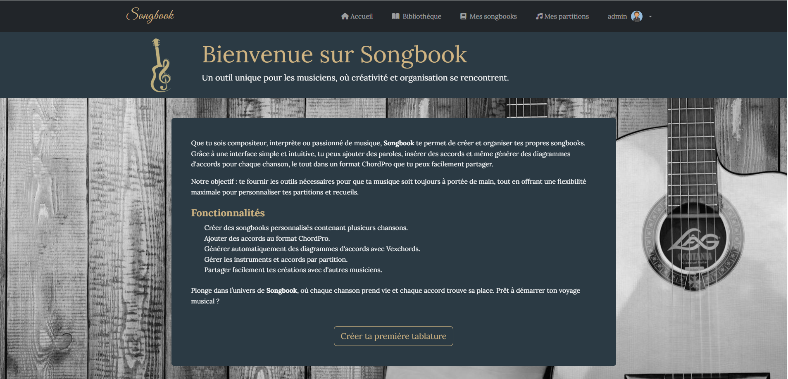
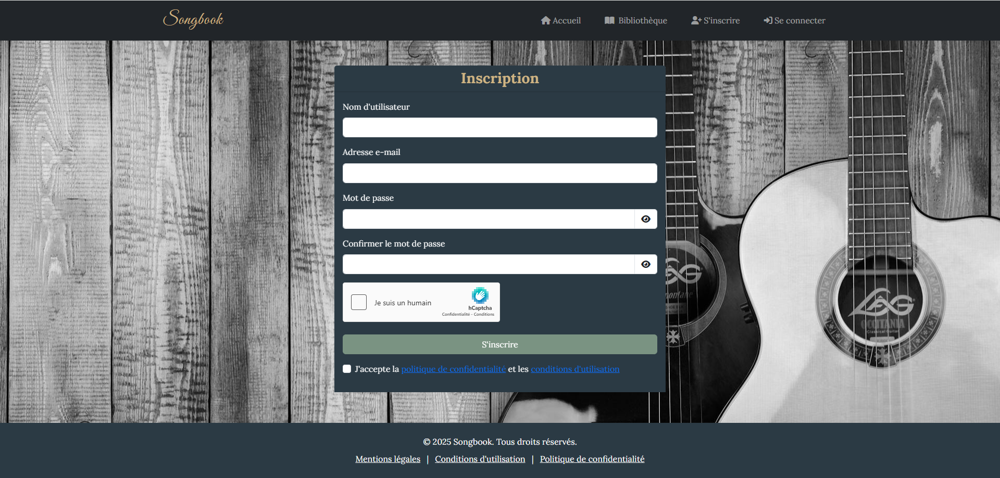
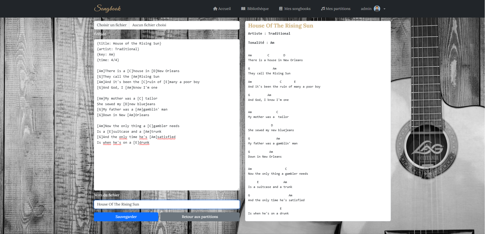
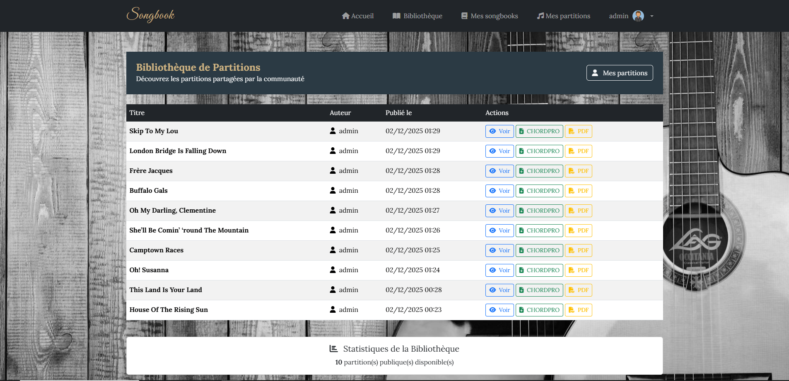
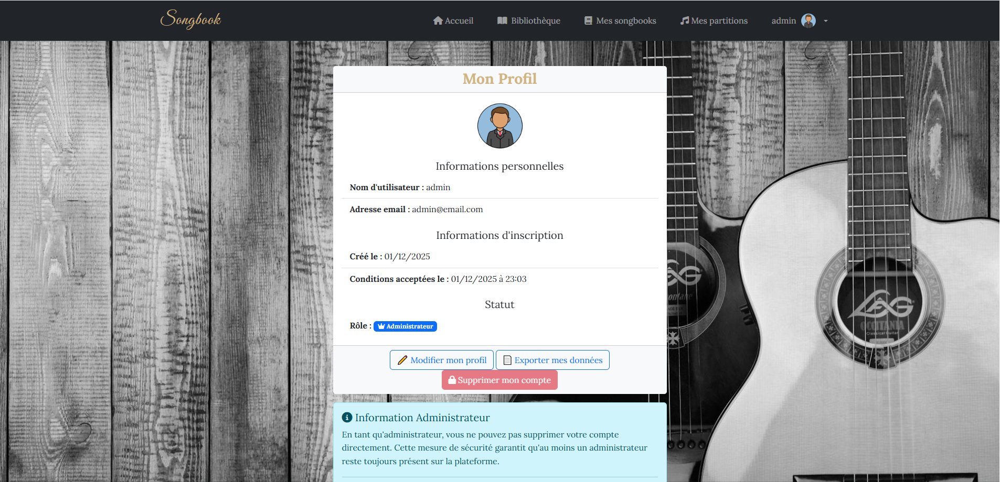
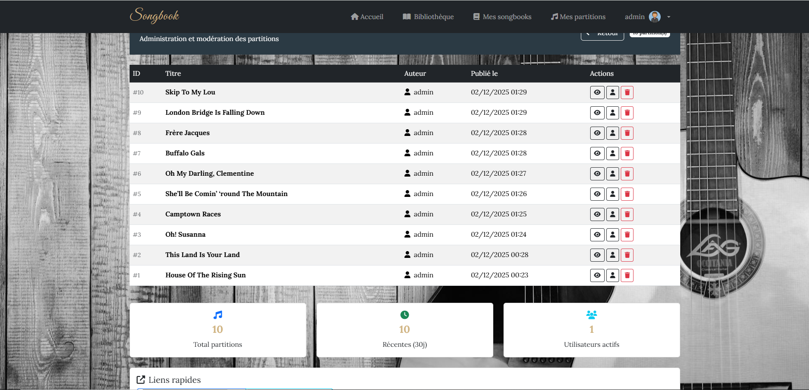

# Songbook
[](https://www.php.net/)
[](https://symfony.com/)
[](https://developer.mozilla.org/fr/docs/Web/JavaScript)
[](https://getbootstrap.com/)
[](https://www.mysql.com/)
[](LICENSE)

**Languages:** [🇬🇧 English](README.md) | [🇫🇷 Français](README_FR.md)

🇳🇱 *A Dutch version will be available in the future.*

## Table of Contents

- [Key Features](#key-features)
- [Technical Overview](#technical-overview)
- [Database Schema](#database-schema)
- [Planned Enhancements](#^planned-enhancements)
- [Preview / Screenshots](#preview--screenshots)
- [Technologies Used](#technologies-used)
- [Installation](#installation)
- [Credits](#credits)

**Songbook** is an interactive music application developed as part of my graduation project. It helps musicians easily manage chord sheets and songbooks, collaborate with others, and prepare their performances—all through a modern, responsive interface.
This full-stack project showcases both backend (PHP/Symfony) and frontend (JavaScript) expertise.

The project demonstrates the complete lifecycle of a modern web application: Symfony architecture, role management, file uploads, dynamic JavaScript UI, chord sheet rendering system, and various administration tools.

---

## Key Features

- Support for ChordPro format for clean, standardized chord sheet rendering
- Creation and management of songbooks
- Chord and tablature management
- Setlist organization for concerts or rehearsals
- Fully responsive and interactive interface

## Résumé technique

- Symfony MVC architecture with dedicated services

- Authentication and role management (User, Moderator, Admin)

- Full CRUD: chord sheets, songbooks, setlists

- ChordPro file upload and parsing

- Dynamic chord sheet rendering

- Full user data export (GDPR compliant)

- Secure account deletion (Admin role transfer required)

- Import/export and profile update system

- Doctrine ORM (entities, relations, migrations, fixtures)

- Validation using Symfony FormTypes

- hCaptcha integration for enhanced security

- Asset management with Webpack Encore

- Administration tools (global chord sheet management + statistics)

## Database Schema

```mermaid
erDiagram

    USER ||--o{ CHORDSHEET : "creates"
    USER ||--o{ SONGBOOK : "owns"
    USER }o--|| ROLE : "has"

    SONGBOOK ||--o{ SONGBOOK_CHORDSHEET : "links"
    CHORDSHEET ||--o{ SONGBOOK_CHORDSHEET : "linked in"

    %% Tables

    USER {
        int id PK
        string email
        string password
        datetime created_at
    }

    ROLE {
        int id PK
        string name
        string description
    }

    CHORDSHEET {
        int id PK
        int user_id FK
        string title
        longtext content
        datetime created_at
        boolean is_public
        datetime published_at
    }

    SONGBOOK {
        int id PK
        int user_id FK
        string title
        string description
        datetime created_at
    }

    SONGBOOK_CHORDSHEET {
        int id PK
        int songbook_id FK
        int chordsheet_id FK
        datetime added_at
        int position
    }

    GENRE {
        int id PK
        string name
        string description
    }

    TONALITY {
        int id PK
        string name
        string description
        string type
    }

    %% (Optional table used by Symfony Messenger)
    MESSENGER_MESSAGES {
        bigint id PK
        longtext body
        longtext headers
        string queue_name
        datetime created_at
        datetime available_at
        datetime delivered_at
    }
```


**Note** GENRE and TONALITY tables are defined in the database but not yet implemented in the application. They will support future features such as classification, advanced filters, and music-related tools.

## Planned Enhancements

- Multimedia integration (audio, images) to enrich chord sheets

- Assigning genres and tonalities to chord sheets for better organization and search tools

- User instrument management, with the ability to link instruments to a songbook and filter chord sheets accordingly—useful for rehearsals and live performances

---

## Preview / Screenshots

### Homepage (public view)


_Public homepage, accessible without authentication._

### Registration Page


_Registration form secured with hCaptcha._

### Chord Sheet Creation


_ChordPro editing panel on the left and live preview on the right. Supports local file import._

### Library


_Registered users can browse or add chord sheets from others. Visitors have read-only access._

### Profile


_Profile page allowing data export and updates. Admin deletion requires prior role transfer._

### Admin Chord Sheet Management


_Administration panel with global statistics._

## Technologies Used

- **Backend** : PHP / Symfony
- **Frontend** : JavaScript
- **Styling** : Bootstrap, SCSS
- **Database** : MySQL
- **Other tools** : Composer, Webpack Encore, GitHub

---

## Installation

### 1. Clone the repository

```bash
git clone https://github.com/gaetan-denis/songbook.git
```

### 2. Install PHP dependencies

```bash
composer install
```

### 3. Install JavaScript dependencies

```bash
npm install
```

### 4. Start the development environment

```bash
npm run dev
```

### 5. Configure the database

- Open the .env file and edit lines 26–29 according to your environment.

- Create the database:

```bash
php bin/console doctrine:database:create
```

- Run migrations:

```bash
php bin/console doctrine:migrations:migrate
```

- Load fixtures:

```bash
php bin/console doctrine:fixtures:load
```

### 6. Start the Symfony server

```bash
symfony server:start
```

## Credits

### SCSS Reset File

- License : MIT

- Author : Fraser Boag

- Repository : [sass-reset](https://github.com/fraserboag/sass-reset)

### Background Image

- Two Grayscale Acoustic Guitars

- oyalty-free image (CC0)

- Source : [Pexels](https://www.pexels.com/photo/two-grayscale-acoustic-guitars-290660/)
